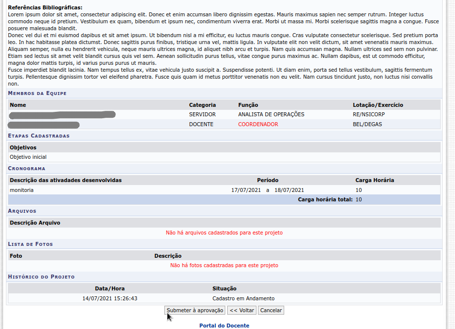

Fluxo de Trabalho
=================

O trabalho com o módulo Projeto de Ensino segue basicamente os seguintes passos:

    - Criação de Edital pelo GESTOR_ENSINO
    - Submissão de uma Proposta de Projeto pelo coordenador (docente ou técnico administrativo)
    - Aprovação da proposta pelo coordenador do curso ao qual a proposta está vinculada
    - Distribuição da proposta para avaliação técnica pela diretoria do campus
    - Execução do Projeto de Ensino
    - Preenchimento de relatório final sobre o Projeto
    - Emissão de certificados/declarações

Criação de Edital
-----------------

Para acessar o formulário de criação de edital o usuário logado, com perfil de cadastro, deve clicar no módulo
Projeto de Ensino:

.. figure:: _static/img/usuario/projeto-ensino-modulo.png
    :align: center
    :class: imagem
    
    Entrada do módulo Projeto de Ensino

.. warning:: Apenas usuários com perfil GESTOR_ENSINO podem cadastrar editais.

Em seguida o usuário deverá clicar no *link* **Cadastrar Edital** na seção **Edital** na aba **Cadastros**:

    *Link* para acessar o formulário de cadastro de edital

Os campos marcados com |required| no formulário são obrigátorios. Ao clicar no botão **Cadastrar Edital** o
edital é cadastrado (caso que não apresente erros de validação):

    Formulário de criação de edital

Submissão da proposta pelo coordenador
--------------------------------------

Uma proposta de proposta de Projeto de Ensino pode ser submetida por docentes ou técnicos administrativos,
dependendo do edital.

Para os usuário docentes, o caminho é Portal do Docente → Ensino → Projetos → Projeto de Ensino → Submenter
Projeto de Ensino.

    *Link* para cadastro de proposta de projeto de ensino

O formulário de cadastro de proposta é um *wizard* formado por 7 sub-formulários. Os campos marcados com
|required| no formulário são obrigátorios. É necessário adicionar pelo menos um **local de realização** clicando
no botão **Adicionar Local de Realização** antes de clicar no botão **Salvar/Avançar**.

    Formulário para cadastro de proposta de projeto de ensino

.. note::
    Ao clicar no botão **Salvar/Avançar** pela primeira vez, a proposta de projeto de ensino é criada com o
    *status* **Cadastro em andamento**. É possível iniciar o cadastro e continuar preenchimento da proposta
    futuramente.

O último sub-formulário contém um resumo da proposta a ser submetida para revisão. Quando o usuário
clica no botão **Submeter Proposta** a mesma é enviada para avaliação pelo coordenador do curso ao qual a
proposta foi vinculada. O *Status* do projeto é alterado de **Cadastro em Andamento** para **Aguardando
Aprovação do Coordenador de Curso**.

    Sub-formulário de revisão para submissão de proposta de projeto de ensino.

.. note:: Ao submeter a proposta um email é enviado para o coordenador de curso alertando sobre a submissão.

O usuário docente pode verificar o andamento de suas submissões pelo caminho é Portal do Docente → Ensino →
Projetos → Projeto de Ensino → Meus Projetos de Ensino.

    Acompanhamento de propostas e projetos de ensino do usuário.

Aprovação pelo coordenador de curso
-----------------------------------

O coordenador do curso ao qual a proposta foi vínculada é notificado por email das submissões de propostas de
projetos de ensino. o coordenador de curso pode acessar as propostas pendentes de avaliação pelo caminho Portal
do Docente → Chefia → Autorizações → Autorizar Projetos de Ensino:

    *Link* para autorização de propostas de projetos de ensino pelo coordenador de curso.

O sistema exibe uma listagem de propostas submetidas e pendentes de avaliação. O coordenador de curso pode
visualizar as propostas clicando no ícone |view| ou, analisar a proposta clicando no ícone |seta| conforme
imagem a seguir:

    Listagem de propostas submetidas.

O coordenador de curso seleciona se a proposta será autorizada ou não além de fornecer um parecer. Ao clicar
no botão **Confirmar** e a proposta foi autorizada, o *Status* da mesma é alterado de **Aguardando Aprovação do Coordenador de Curso**
para **Enviado para análise do campus**:

    Formulário de análise de proposta.

